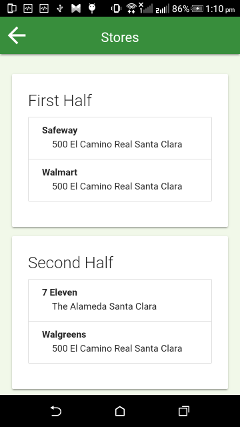
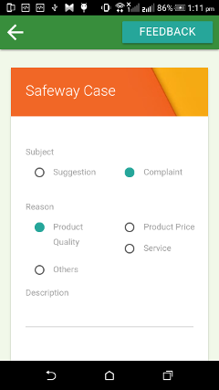

# SALES APP PROTOTYPE : CASE STUDY DABUR

Dabur is India's largest Ayurvedic medicine & natural consumer products manufacturer. Dabur demerged its Pharma business in 2003 and hived it off into a separate company, Dabur Pharma Ltd.

## Scenario

Sales person typically spend his day by visiting stores in his region. He performs following task
- Visits the store
- Surveys their product placement and inventory level
- Surveys their competitor product's placement and inventory level
- Take orders from storekeeper

Sales person ususally uses notebook to take order and record inventory. They often does not get a clear picture of previous inventory level of that store and how the sells performed.

Management also get a fuzzy idea about the product sells.

## Prototype

Sales App is a mobile app that can help sales person to perform their daily responsibilities and tracking sales in the region.

Sales App helps
- By tracking store list that needs to be visited
- Tracking previous inventory level for each store
- Providing ability to take product placement snaps and mechanism to store product share compare to competitor's product
- Providing ability to take order

Sales Person can also
- Access current offering by the product
- Individual performance in a graphical dashboard

## Screenshots






## Setting up the development environment

- Install [Node.js](https://nodejs.org/en/download/)
- Install [Java JDK](http://www.oracle.com/technetwork/java/javase/downloads/jdk8-downloads-2133151.html)
- Install [Android SDK](https://developer.android.com/studio/install.html)
- Install [Gradle](https://gradle.org/install/)
- Install [Cordova](https://cordova.apache.org/docs/en/latest/guide/cli/)
```sh
	$ npm install -g cordova
```

## Compiling

```sh
	$ cd cordova-module
	$ cordova prepare android
	$ cordova compile android
```

## Building

```sh
	$ cordova build android
	$ cordova run android
```

